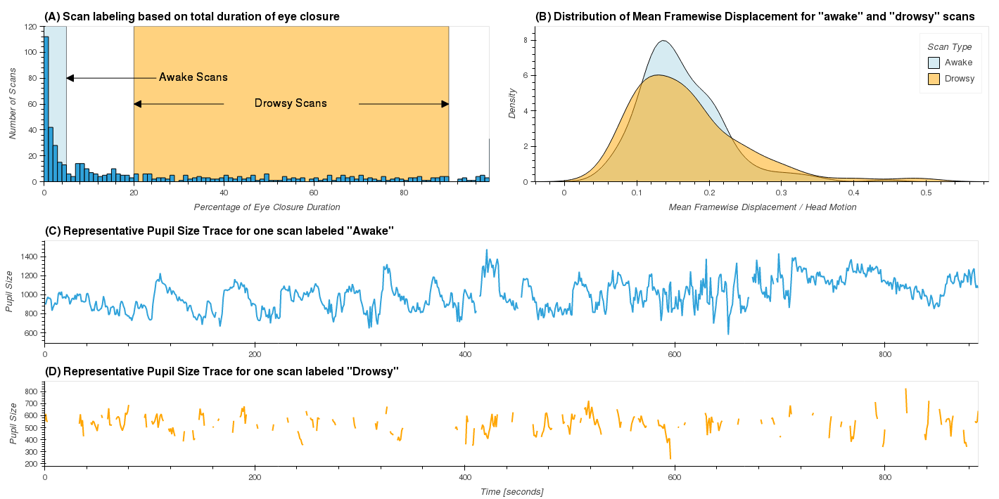
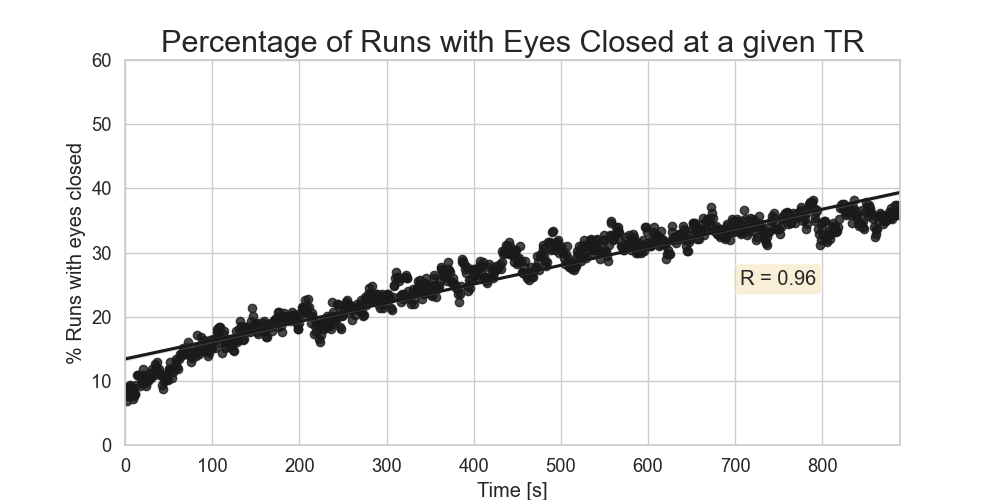

# Description
***

This repository contains the code used in the publication "Temporary Title" that investigates the potential value of ultra-slow fluctuations around 0.05Hz in inferior ventricular regions as a marker of light sleep when fMRI-data is available. This work relies on the publicly available 7T resting-state sample from the human connectome project.

# Pre-requisites
***

In addition to several python libraries, this project also relies on a set of additional software and data that will need to install first.

## Required Software Packages

* **AFNI** (https://afni.nimh.nih.gov/): for pre-processing and transformation of structural and functional data.
* **RapidTide** (https://rapidtide.readthedocs.io/en/latest/): for estimation of lag profiles of signals across the brain.
* **NBS** (https://www.nitrc.org/projects/nbs): for statistical analysis of brain networks (requires MATLAB)
* **BrainNetViewer** (https://www.nitrc.org/projects/bnv/): for visualization of brain networks (requires MATLAB)

## Required Brain Parcellations

Here, we use the 200 ROI version of the Scheffer Atlas (https://github.com/ThomasYeoLab/CBIG/tree/master/stable_projects/brain_parcellation/Schaefer2018_LocalGlobal). 

1. Create a local folder for brain parcellations: (e.g., ```<DATA_DIR>/Atlases```)

2. Create a sub-folder for the 200 Schaefer Atlas named Schaefer2018_200Parcels_7Networks: (e.g., ```<DATA_DIR>/Atlases/Schaefer2018_200Parcels_7Networks```)

3. Copy the following files from their original location in CBIG repo (link above) to your local Schaefer Atlas folder:

* ```stable_projects/brain_parcellation/Schaefer2018_LocalGlobal/Parcellations/MNI/Schaefer2018_200Parcels_7Networks_order_FSLMNI152_2mm.nii.gz```
* ```stable_projects/brain_parcellation/Schaefer2018_LocalGlobal/Parcellations/MNI/freeview_lut/Schaefer2018_200Parcels_7Networks_order.txt```
* ```stable_projects/brain_parcellation/Schaefer2018_LocalGlobal/Parcellations/MNI/fsleyes_lut/Schaefer2018_200Parcels_7Networks_order.lut```
* ```stable_projects/brain_parcellation/Schaefer2018_LocalGlobal/Parcellations/MNI/Centroid_coordinates/Schaefer2018_200Parcels_7Networks_order_FSLMNI152_2mm.Centroid_RAS.csv```

4. Write down the path to the local Schaefer Atlas folder, as you will need it in Step 1 of "How to run this code" below.

> NOTE: By following this naming convention, it should be easy to use other atlases 

# How to run this code
***

**1. Configure your local version of the Repository**

   a. Provide the correct values to the ```DATA_DIR``` and ```SCRIPTS_DIR``` variables in ```utils/variables.py```.
   
   * ```DATA_DIR```: folder where you want to download the HCP dataset and perform all necessary analyses
   * ```SCRIPTS_DIR```: folder where you downloaded this repository
   
   b. provide your XNAT central user and password in ```utils/variables.py```.
   
   * ```XNAT_USER```: provide your username
   * ```XANT_PASSWORD```: provide your password
   
**2. Create the necessary conda environments**

To run this code you will need two separate conda environments:

   a. ```pyxant_env```: This environment is used by notebook ```N00_DownloadDataFromHCPXNAT```. This notebook downloads all the necessary data from XNAT Central using the pyxnat library. Because this library is not compatible with the latest version of other libraries used in this work, we need to create a separate environment just for this first notebook. A ```.yml``` file with the description of this first environment is provided in ```env_files/pyxnat_env.yml```
   
   b. ```hcp7t_fv_sleep_env```: This environment is valid for all other notebooks. A ```.yml``` file with the description of this second environment is provided in ```env_files/hcp7t_fv_sleep_env.yml```

**2. Download data from XNAT**

Notebook ```N00_DownloadDataFromHCPXNAT``` contains the necessary code to downlaod all necessary data files from XNAT Central.

This notebook used the ```pyxant_env``` environment.

Many cells on this notebook will take a long time (over one hour). Be ready for that with a nice cup of coffee.

**3. Basic QA**

Notebook ```N01_QA``` will help us identify resting-state runs with issues such as missing ET data, ET files that do not load correctly, or have an incorrect number of volumes. Those will not be used in further analyses. This notebook will write a dataframe with this information that it is used in subsequent notebooks to load only valid data.

**4. ET-Preprocessing (& additional QA)**

Notebook ```N02_ET-Preprocessing``` does all the pre-processing of the ET data as described in the manuscript. During the pre-processing, we detected a couple extra issues with a few runs. Namely, three runs did not have complete ET timeseries and 4 runs did not have information to permit synchronization of ET and fMRI data. At the completion of this notebook, you should have fully pre-processed ET traces stored in ```Resources/ET_PupilSize_Proc_1Hz_corrected.pkl``` for the 561 runs that passed all QA controls.

**5. Label Runs (Drowsy / Awake)**

Notebook ```N03_LabelRestRuns``` will label runs with eyes closed less than 95% of the time as "awake" and runs with eyes closed between 20% and 90% as "drwosy". The rest of the runs will be discarded. Those labels will be used in many subsequent analyses. This notebook also generates main figures 1 and 4.

| Figure 1                                                              | Figure 4                                                               |
|-----------------------------------------------------------------------|------------------------------------------------------------------------|
|  |  |

**6. Identify Long Segments of Eye Closure and Eye Opening**

This operation is also conducted by notebook ```N03_LabelRestRuns```. This notebook generates two pickle files ```Resources/EC_Segments_Info.pkl``` and ```Resources/EO_Segments_Info.pkl``` that contain information about every single EC and EO segment. Such information includes, among others, a unique identifier per segment (used to name files), segment onset, segment offset and segment duration.

** 7. **
